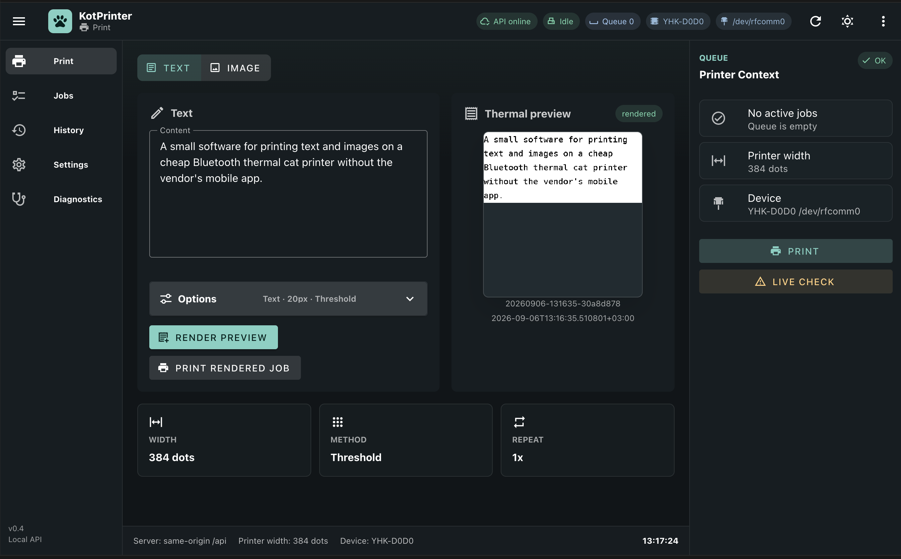

# Yet Another Cat Printer


A small Python CLI for printing text and images on a cheap Bluetooth thermal
cat printer without the vendor mobile app.

Current release: `0.4`.

New in `0.4`: a local web UI for desktop and mobile browsers, so you can print,
manage the queue, review history, adjust settings, run diagnostics, and reprint
jobs from one place.

The tested printer ignores many normal POS commands, so this tool renders text
and images into a `384`-dot-wide 1-bit raster and sends that raster over
Bluetooth RFCOMM. It is not a CUPS driver. The local server mode is a small
trusted-device API and web UI for this project, not a general system print
spooler.

The classic entrypoint still works:

```sh
python3 print.py text 'hello'
```

The package entrypoint also works:

```sh
python3 -m kotprinter text 'hello'
```

## Features

- Print Unicode text by rendering it to an image first.
- Print PNG, JPEG, and other image formats supported by Pillow.
- Preview any text or image job as `debug.png` without touching the printer.
- Configure printer, text, and image defaults with `kotprinter.json`.
- Check local dependencies, Bluetooth, RFCOMM, systemd, permissions, and live
  printer reachability.
- Generate and install systemd services for RFCOMM binding and the local web
  UI/API server.
- Tune text size, alignment, padding, line spacing, and text density.
- Tune image brightness, contrast, gamma, dithering, thresholding, inversion,
  rotation, crop, fit, and autofit behavior.
- Use presets for common jobs: `text`, `label`, `photo`, and `sticker`.
- Use the install-time RFCOMM service, serial-device permissions, and a narrow
  sudoers recovery rule during runtime.
- Create durable rendered jobs with exact preview artifacts.
- Run a local HTTP API with queue, history, settings, diagnostics, and reprint.
- Serve the built Vue/Vuetify frontend from the same origin as `/api`.

## Web UI Screenshots



More screenshots are in [`assets/screenshots`](https://github.com/kotXio/kotPrinter/blob/main/assets/screenshots).

## Supported Printer

Tested with a `YHK-D0D0` style Bluetooth cat printer.

Known hardware details:

- Bluetooth thermal printer
- 384-dot print width
- Internal `18650` battery
- USB-C charging
- One physical button
- Long button press turns the printer on or off
- Double button press prints the printer self-test and MAC address

Similar cat printers may work, but the Bluetooth MAC address, RFCOMM channel,
print width, and protocol behavior may differ.

## Installation

Clone the repository:

```sh
git clone https://github.com/kotXio/kotPrinter.git
cd kotPrinter
```

Install system dependencies on Debian or Raspberry Pi OS:

```sh
sudo apt update
sudo apt install python3 python3-pip fonts-dejavu-core bluez
```

Install Python dependencies:

```sh
python3 -m pip install "Pillow>=9.4" "pyserial>=3.5"
```

Or install them from distro packages:

```sh
sudo apt install python3-pil python3-serial
```

Allow your user to access serial devices:

```sh
sudo usermod -aG dialout "$USER"
```

Log out and back in after changing groups.

The default font is provided by `fonts-dejavu-core`:

```text
/usr/share/fonts/truetype/dejavu/DejaVuSansMono.ttf
```

To use another font, set `text.font` in `kotprinter.json` or pass another config
file with `--config`.

## Printer Setup

Turn on the printer first. If you do not know its MAC address, double press the
printer button to print the self-test page, or scan for it:

```sh
bluetoothctl
scan on
```

Edit the `device` block in `kotprinter.json`:

```json
{
  "device": {
    "name": "MY-CAT-PRINTER",
    "mac": "AA:BB:CC:DD:EE:FF",
    "channel": 2,
    "port": "/dev/rfcomm0",
    "baudrate": 115200,
    "rfcommService": "rfcomm-printer.service"
  }
}
```

For the tested printer, RFCOMM channel `2` is correct. Keep `/dev/rfcomm0`
unless you intentionally want a different local RFCOMM device.

Pair and trust the printer:

```sh
bluetoothctl
scan on
pair AA:BB:CC:DD:EE:FF
trust AA:BB:CC:DD:EE:FF
quit
```

Generate and inspect the systemd services:

```sh
python3 print.py install --dry-run
```

`install --dry-run` is read-only. It prints the generated RFCOMM and server
units plus the system commands that would be run.

Apply it:

```sh
python3 print.py install
```

`install` writes generated services to `/etc/systemd/system`, installs a narrow
sudoers rule in `/etc/sudoers.d/kotprinter-rfcomm`, runs
`systemctl daemon-reload`, and enables/restarts the configured RFCOMM and
KotPrinter server services. It reports serial group membership but does not
change user groups automatically.

The sudoers rule allows the runtime user to run only this recovery command
without a password:

```sh
sudo -n /usr/bin/systemctl restart rfcomm-printer.service
```

The RFCOMM service is generated from the active config. The checked-in
`systemd/rfcomm-printer.service` file is only an example for the tested printer;
do not edit it for normal installs. The server service is generated from the
resolved project root at install time, so the installed unit does not depend on
a hardcoded checkout path in the source code.

Build the frontend before applying the install plan:

```sh
cd web
npm run build
cd ..
```

The server unit intentionally does not run npm during boot. If `web/dist` is
missing, `install --dry-run` warns and `install` fails before writing services.

This printer does not keep a permanently active Bluetooth connection after each
job. Tools may show the RFCOMM connection as closed when the printer is idle.
That is not necessarily a failure: the connection is opened again when the CLI
prints, runs `info`, or runs `check --live`.

If you prefer to bind RFCOMM manually, use the configured MAC address and
channel:

```sh
sudo rfcomm release /dev/rfcomm0
sudo rfcomm bind /dev/rfcomm0 AA:BB:CC:DD:EE:FF 2
ls -l /dev/rfcomm0
```

## Quick Start

Check the CLI version:

```sh
python3 print.py --version
python3 -m kotprinter --version
```

Check the local setup:

```sh
python3 print.py check
python3 print.py check --live
```

`check` is read-only. `check --live` opens the configured RFCOMM device and
sends the wake/info handshake, but it does not print paper.

Do not treat an idle closed RFCOMM connection as proof that printing is broken.
Use `check --live`, `info`, or a preview/print command to test the real path.

Show printer info:

```sh
python3 print.py info
```

`info` queries voltage, DPI, battery estimate, serial number, and effective
settings. It does not print paper.

Print text:

```sh
python3 print.py text 'hello cat printer'
```

Print an image:

```sh
python3 print.py img ./picture.png
```

Preview instead of printing:

```sh
python3 print.py text 'preview only' --preview
python3 print.py img ./picture.png --preview
```

Preview output is written to `debug.png` in the current working directory.

## Local Web UI And API

The local server can serve both the HTTP API and the built frontend from one
origin. For normal local use, run:

```sh
./run-web.sh
```

The script installs frontend dependencies if needed, builds `web/dist` if it is
missing, prints the local/LAN URLs, and starts `kotprinter.server`.

Useful overrides:

```sh
KOTPRINTER_REBUILD=1 ./run-web.sh
KOTPRINTER_PORT=18080 ./run-web.sh
KOTPRINTER_HOST=127.0.0.1 ./run-web.sh
KOTPRINTER_LAN_HOST="$(hostname -I | awk '{print $1}')" ./run-web.sh
```

Manual build/start commands are:

```sh
cd web
npm install
npm run build
cd ..
```

Start the backend from the project root. Use localhost for machine-local access:

```sh
python3 -m kotprinter.server --host 127.0.0.1 --port 8000 --project-root "$PWD"
```

Use the Pi LAN address only on a trusted local network:

```sh
python3 -m kotprinter.server --host 0.0.0.0 --port 8000 --project-root "$PWD"
```

For LAN access, use the `LAN:` URL printed by `./run-web.sh`. If you start the
server manually, run `hostname -I` on the Pi and use its LAN address as the
browser host. Phones, tablets, and desktops on the same trusted LAN use that
same URL. On the Pi itself, use `http://127.0.0.1:8000/` or the LAN URL.

Useful direct routes:

```text
/print
/jobs
/history
/settings
/diagnostics
/api/health
```

The frontend calls same-origin `/api`, so phone and tablet browsers do not need
to know about `127.0.0.1` and do not depend on a separate CORS setup.

Server mode has no login or user model. Do not expose it to the internet,
public DNS, or an untrusted network without a separate security design.

For frontend development, Vite can still be used from `web/`; its dev server
proxies `/api` to `http://127.0.0.1:8000`.

## Common Recipes

Text:

```sh
python3 print.py text 'hello'
python3 print.py text 'CENTER' --align center --size 28
python3 print.py text 'A\n\nB' --line_spacing 1.0
python3 print.py text 'quiet label' --text-density light
python3 print.py text 'bold label' --text-density dark
python3 print.py text 'LABEL' --preset label
```

Images:

```sh
python3 print.py img ./photo.jpg --preset photo --preview
python3 print.py img ./photo.jpg --preset photo
python3 print.py img ./label.png --preset label
python3 print.py img ./qr.png --preset text --threshold 150
python3 print.py img ./photo.jpg --fit contain --height 512
python3 print.py img ./photo.jpg --fit cover --height 512 --crop-align center
python3 print.py img ./photo.jpg --fit autofit
python3 print.py img ./label.png --invert --threshold 160
```

Use preview-first iteration for image tuning:

```sh
python3 print.py img ./photo.jpg --preset photo --fit autofit --preview
python3 print.py img ./photo.jpg --preset photo --fit autofit
```

Use an alternate config:

```sh
python3 print.py --config ./my-printer.json check
python3 print.py --config ./my-printer.json text 'hello'
python3 -m kotprinter --config ./my-printer.json img ./picture.png --preview
```

Global options such as `--config` must appear before the command name.

## Configuration

The CLI has built-in defaults, so it can run without a config file. When
`kotprinter.json` exists in the current working directory, it is loaded
automatically. Use `--config PATH` to load a different JSON config.

Precedence:

```text
built-in defaults -> JSON config -> preset defaults -> explicit CLI arguments
```

The checked-in `kotprinter.json` is a complete example for the tested printer.
Supported config sections:

| Section | Keys |
| --- | --- |
| `schemaVersion` | currently `1` |
| `device` | `name`, `mac`, `channel`, `port`, `baudrate`, `rfcommService` |
| `printer` | `width`, `feed`, `repeat` |
| `text` | `font`, `fontSize`, `padY`, `align`, `lineSpacing`, `density` |
| `image` | `method`, `brightness`, `contrast`, `gamma`, `rotate`, `fit`, `height`, `cropAlign`, `invert`, `threshold` |

Important rules:

- Unknown config keys are ignored with a warning.
- Invalid known values fail with a short CLI error.
- `schemaVersion` must be `1`.
- `device.mac` must be a Bluetooth MAC address.
- `device.port` must be an absolute path.
- `device.rfcommService` must be a `.service` name using only letters,
  numbers, dots, underscores, hyphens, and `@`.
- `printer.width` must be divisible by `8`.
- `image.rotate` must be `0`, `90`, `180`, or `270`.
- `image.threshold` must be `0..255` or `null`.

For RFCOMM install, the `device` block is the source of truth. `install` does
not prompt for a MAC address and does not read the checked-in systemd example as
the primary input.

## Command Reference

Entrypoints:

```sh
python3 print.py --version
python3 print.py [--config PATH] COMMAND ...
python3 -m kotprinter --version
python3 -m kotprinter [--config PATH] COMMAND ...
python3 -m kotprinter.server [--host HOST] [--port PORT] [--project-root PATH]
```

Commands:

| Command | Description |
| --- | --- |
| `check [--live]` | Inspect local setup, frontend build, server service, and printer environment. `--live` also contacts the printer without printing. |
| `install [--dry-run]` | Generate and install the systemd RFCOMM binding and KotPrinter server services. |
| `info` | Query printer voltage, DPI, battery estimate, serial number, and settings. |
| `text TEXT [options]` | Render text to a raster image and print it. |
| `img PATH [options]` | Render an image file to a raster image and print it. |

Server entrypoint:

```sh
python3 -m kotprinter.server --host 127.0.0.1 --port 8000 --project-root "$PWD"
```

Important server options:

| Option | Description |
| --- | --- |
| `--host` | Bind address. Defaults to `127.0.0.1`; use `0.0.0.0` only for trusted LAN access. |
| `--port` | HTTP port. Defaults to `8000`. |
| `--project-root` | Project root used for `kotprinter.json`, `data/`, and `web/dist`. |
| `--config` | Explicit config path. |
| `--data-root` | Explicit job/history data root. |
| `--server-service` | Systemd service name expected by diagnostics; defaults to `kotprinter.service`. |
| `--static-root` | Explicit frontend build directory; defaults to `PROJECT_ROOT/web/dist`. |

### Text Options

| Option | Values | Description |
| --- | --- | --- |
| `--preset` | `text`, `label` | Apply named defaults before explicit text options. |
| `-s`, `--size` | integer `> 0` | Font size in pixels. |
| `-a`, `--align` | `left`, `center`, `right` | Horizontal alignment. |
| `-p`, `--pad_y` | integer `>= 0` | Top and bottom padding in pixels. |
| `-l`, `--line_spacing` | float `>= 0` | Extra line spacing as a multiplier of font size. |
| `--text-density` | `light`, `normal`, `dark` | Text raster density. |

### Image Options

Image files can be any format supported by Pillow, for example PNG or JPEG.
EXIF orientation is applied before explicit rotation, crop, and fit.

| Option | Values | Description |
| --- | --- | --- |
| `--preset` | `text`, `label`, `photo`, `sticker` | Apply named defaults before explicit image options. |
| `--rotate` | `0`, `90`, `180`, `270` | Rotate clockwise before crop and fit. |
| `--crop` | `left,top,width,height` | Crop the rotated source image before fit. |
| `--fit` | `width`, `contain`, `cover`, `stretch`, `none`, `autofit` | Map the image to the printer width. |
| `--height` | integer `> 0` | Target height for `contain`, `cover`, `stretch`, and height-aware `autofit`. |
| `--crop-align` | `top`, `center`, `bottom` | Vertical crop alignment for `cover`. |
| `--invert` | flag | Invert black and white before final 1-bit conversion. |
| `--threshold` | integer `0..255` | Use an exact threshold instead of dithering. |

Fit behavior:

- `width` preserves aspect ratio and scales to the configured printer width.
- `contain` preserves aspect ratio inside `printer.width x --height` and pads
  with white.
- `cover` fills `printer.width x --height`, preserving aspect ratio and cropping
  overflow.
- `stretch` forces the exact `printer.width x --height` size.
- `none` avoids scaling and clips or pads to the configured printer width.
- `autofit` chooses a predictable rotation and fit mode, then prints the chosen
  decision.

Image processing order:

```text
open image
-> apply EXIF orientation
-> rotate or autofit rotation
-> crop
-> fit, resize, crop, or pad
-> brightness, contrast, gamma
-> invert
-> threshold or dithering
-> raster print
```

### Presets

| Preset | Commands | Intended use | Defaults |
| --- | --- | --- | --- |
| `text` | `text`, `img` | text, documents, screenshots, QR-like images | `method=th`, `contrast=1.2`; images also use `threshold=160`, `fit=width` |
| `label` | `text`, `img` | labels and simple graphics | text uses safe Floyd-Steinberg plus dark density; images use ordered rendering |
| `photo` | `img` | photos and smoother gradients | `method=fs`, `contrast=1.1`, `gamma=0.95`, `fit=autofit` |
| `sticker` | `img` | icons and high-contrast illustrations | `method=ordered`, `contrast=1.35`, `brightness=1.05`, `gamma=0.9`, `fit=autofit` |

Preset values are defaults. Explicit CLI options override them:

```sh
python3 print.py img ./photo.jpg --preset photo --contrast 1.4 --method ordered
python3 print.py text 'label' --preset label --text-density normal
```

### Shared Render Options

These options are available for both `text` and `img`:

| Option | Values | Description |
| --- | --- | --- |
| `-m`, `--method` | `fs`, `ordered`, `th` | Raster conversion method. |
| `-b`, `--brightness` | float `> 0` | Brightness multiplier before 1-bit conversion. |
| `-c`, `--contrast` | float `> 0` | Contrast multiplier before 1-bit conversion. |
| `-g`, `--gamma` | float `> 0` | Gamma correction before 1-bit conversion. |

For normal text darkness control, prefer `--text-density`. Extreme
brightness/contrast/gamma values can turn text into a blank raster or a solid
black stripe.

### Shared Print Options

These options are available for both `text` and `img`:

| Option | Values | Description |
| --- | --- | --- |
| `--feed` | integer `>= 0` | Number of newline feed lines after printing. |
| `--repeat` | integer `> 0` | Send the same raster payload multiple times. |
| `--preview` | flag | Save `debug.png` instead of opening the printer. |

## How It Works

The printer protocol used here is intentionally simple:

1. Open the configured RFCOMM device, `/dev/rfcomm0` by default, at the
   configured baudrate, `115200` by default.
2. Send a short wake/info handshake.
3. Render text or image input into a 1-bit raster at the configured printer
   width, `384` dots by default.
4. Pack image rows into ESC/POS-style raster bytes.
5. Send the raster payload to the printer in height-bounded bands.
6. Feed paper by sending newline characters.

The CLI retries the wake handshake before a job. If the configured RFCOMM device
is missing, stale, or does not wake the printer, runtime performs one automatic
recovery attempt by running the exact sudoers command installed by `install`:
`sudo -n /usr/bin/systemctl restart rfcomm-printer.service`. Server runtime
also applies a short cooldown so repeated API calls cannot loop privileged
restarts. The CLI does not retry after a payload write failure because the
printer may already have produced a partial print.

Long images are split into several ESC/POS raster commands before transmission.
This keeps large photo prints from overwhelming the small printer buffer while
leaving preview output unchanged.

## Troubleshooting

### Start With The Built-In Checks

```sh
python3 print.py check
python3 print.py check --live
python3 print.py info
```

`check --live` and `info` contact the printer but do not print paper.

### `/dev/rfcomm0` Exists, But The Printer Does Not Answer

`/dev/rfcomm0` existing does not prove the printer is awake or connected. The
printer may be off, asleep, out of range, already busy, or the RFCOMM bind may
be stale.

After a successful job, the tested printer often drops the active Bluetooth
connection while leaving the RFCOMM binding in place. That idle state can look
misleading in low-level diagnostics. A new `info`, `check --live`, or print
command should reconnect for the duration of the operation.

Try:

```sh
python3 print.py info
```

If that still fails, power-cycle the printer and retry. Runtime will attempt one
automatic RFCOMM service restart when opening the printer. If recovery fails,
check that `install` was run after this version so the sudoers rule exists, then
repair the service manually if needed:

```sh
sudo systemctl restart rfcomm-printer.service
python3 print.py info
```

### The Printer Goes Away After Sitting Idle

This printer runs on battery and may power off or sleep by itself. Turn it on
again before printing. A long button press toggles power.

### `install` Fails With `sudo -n`

`install` uses non-interactive `sudo -n`, so it fails instead of prompting for a
password. Run it from a user with passwordless sudo for the required systemd and
sudoers commands, run it as root, or copy the commands printed by
`install --dry-run` and run them manually.

### Permission Denied Opening `/dev/rfcomm0`

Make sure the current user is in the serial device group, usually `dialout`:

```sh
groups "$USER"
sudo usermod -aG dialout "$USER"
```

Log out and back in after changing groups.

### Text Density Looks Wrong

Use:

```sh
python3 print.py text 'sample' --text-density light
python3 print.py text 'sample' --text-density normal
python3 print.py text 'sample' --text-density dark
```

Avoid using extreme `--brightness`, `--contrast`, or `--gamma` values for text.
Those options are generic raster preprocessing controls and can overdrive text
into an empty or fully black raster.

### Image Output Is Too Dark Or Too Light

Try preview first:

```sh
python3 print.py img ./photo.jpg --preview
```

Then adjust:

```sh
python3 print.py img ./photo.jpg --preset photo --brightness 1.2
python3 print.py img ./photo.jpg --preset photo --contrast 1.3 --gamma 1.1
python3 print.py img ./photo.jpg --method th --threshold 160
```

### Desktop Bluetooth Widgets

On Raspberry Pi desktop systems, a panel Bluetooth widget can register its own
BlueZ agent and may interfere with command-line pairing or recovery. During
setup, keep the GUI Bluetooth menu closed and use `bluetoothctl` consistently.

### Useful System Commands

```sh
systemctl status bluetooth.service --no-pager
systemctl status rfcomm-printer.service --no-pager
systemctl status kotprinter.service --no-pager
journalctl -u rfcomm-printer.service -n 50 --no-pager
journalctl -u kotprinter.service -n 50 --no-pager
rfcomm -a
ls -l /dev/rfcomm0
bluetoothctl show
bluetoothctl devices
```

## Known Limitations

- Tested with one printer model, currently identified as `YHK-D0D0`.
- Similar printers may need a different MAC address, RFCOMM channel, width, or
  protocol behavior.
- The checked-in systemd unit is only an example/template for the tested
  printer. Real installs are generated from the active config.
- The tool prints raster images; many normal POS text commands are ignored by
  this printer.
- The tested printer can behave as powered off after idle sleep; if it does not
  answer, turn it on manually and retry.
- Local server mode has no authentication; keep it on localhost or a trusted
  LAN unless a separate security layer is designed.
- No CUPS integration is provided.

## Author

Kostiantyn Andriiuk

## License

MIT. See [LICENSE](LICENSE).
